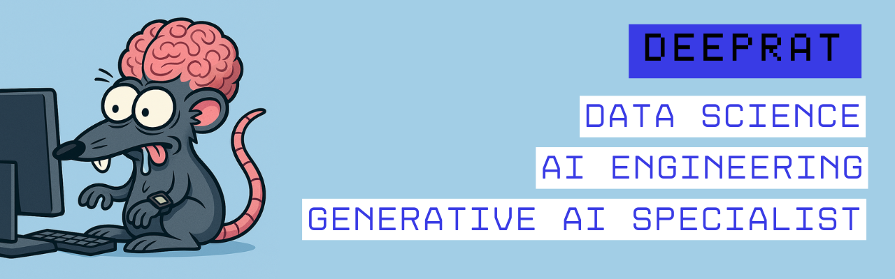
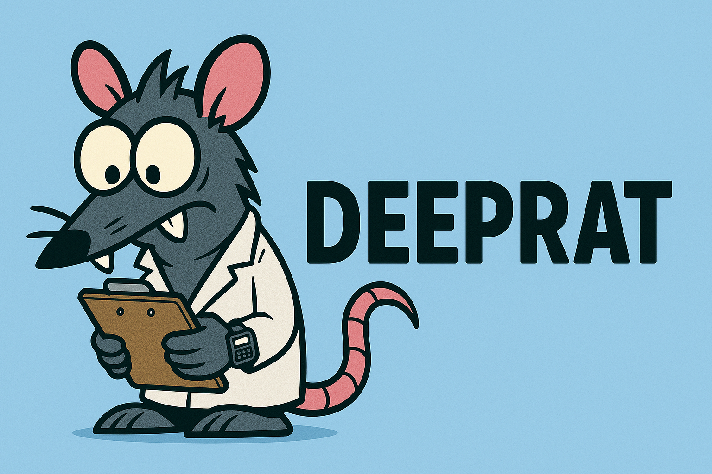

  

# 🧠 Deeprat — Gonzalo [Data Scientist & AI Engineer]

> *“Make the complex accessible. Make the invisible useful. And have a bit of fun along the way.”*

---
### 💡 About This Repository

This repository is not static — it's more like a **technical lab journal** that updates when inspiration, obsession, or GPU availability strike.

I plan to share new experiments, tools, ideas, and studies **on a regular basis**, as time and brain cells permit.  
Everything here is intended to be **explored, adapted, learned from, and built upon**.

Most of it is made using open or freely available resources, with learning and experimentation in mind.  
It’s part notebook, part lab, part sandbox — powered by curiosity, caffeinated neurons, and the occasional existential crisis.

If it helps you build, understand, or break something better: mission accomplished.

---

## 👋 About Me

Hi, I’m Gonzalo — but online, I go by **Deeprat**.  
Data Scientist. AI Engineer.  
Unofficial lab rodent of the digital world.

When I was 6, *Cosmos* by Carl Sagan landed in my hands. I didn’t choose it — it just fell into my life like a prophecy.  
Since then, I’ve sprinted through every branch of science with the energy of a child hopped up on **multiple Red Bulls**:  
physics, biology, mathematics, psychology, philosophy. If it had structure, I wanted to tear it apart and understand it.

Eventually, I found my true home: **artificial intelligence**.  
My curiosity had found its perfect outlet. I could spend endless hours programming, analyzing data, building models, and trying to make machines do what humans barely understand.

This is where my obsessions collide:  
**learning**, **building**, **trying to comprehend the incomprehensible**...  
Or at least, training an AI to fake it convincingly.

---

## 🛠 What I Do

- 🧩 Data Scientist & Artificial Intelligence Engineer  
- 🧠 Creator of intelligent systems focused on:
  - Education  
  - Disinformation  
  - Generative Art  
  - Model Benchmarking
- 🔍 Translator between confused humans and confused machines  
- 🧹 Pattern hunter in the wilderness of messy datasets

---

## 🎓 Technical Background

- 🧪 **Certified in AI Engineering** — *IBM*  
- 🧠 **Specialization in Generative AI with LLMs** — *DeepLearning.ai + IBM*  
- 🐍 **Diploma in Machine Learning with Python**  
- 🏗 Currently studying **Computer Engineering** — *UTN*

---

## ✨ Work Philosophy

I work compulsively — not out of pressure, but because I love what I do and quitting has never been an option.  
Every problem is an invitation to dive deeper. Challenges don’t wear me down; they wind me up.

I value both the result *and* the process. I learn constantly, and I apply what I learn obsessively.  
To me, code isn't just execution — it's exploration, iteration, and the art of building systems that think, adapt, and improve.

The work never truly ends. That’s the point.

---

## 🚀 Let's Connect

If you've made it this far, you're probably a fellow curious mind. Welcome to the lab.

- 📫 [LinkedIn](https://www.linkedin.com/in/gonzalo-luis-romero-b9b5b4355/)  
- 🧪 [Medium](https://medium.com/@yourusername)  
- 💬 [Twitter / X](https://twitter.com/yourusername)  
- 📂 Check out my featured projects in this repo and more to come.

---

  

> **Deeprat™** — because even rats can have good ideas.
