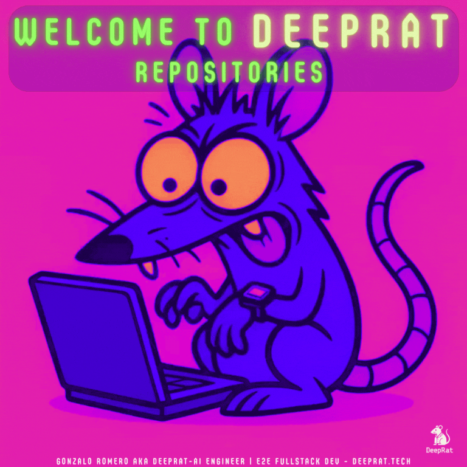
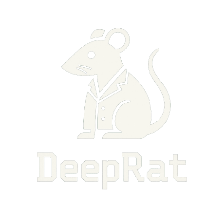

| | |
|---|---|
|  | <h2>Gonzalo Romero, aka **𝔇𝔢𝔢𝔭ℜ𝔞𝔱** :</h2> ingeniero de IA especializado en IA generativa multimodal y sistemas de IA aplicada. Pasión por la ciencia desde los 6 años gracias a Carl Sagan. Amo la tecnología y la información; son los pilares de mi día a día. Programando, estudiando y experimentando desde mi primera computadora. Más de 12 años de formación continua entre cursos y certificaciones (20+), universidad y aprendizaje autodidacta.       |

## 🚀 Projects

| | |
|---|---|
| 

 | **LTX Fast (ItV & PtV) — Smart ZeroGPU Inference** Optimized video generation demos (research-grade). *DeepRat implementation*   |
| 

 | **MedeX — Advanced Medical AI Assistant** RAG + LLM clinical reasoning (educational prototype). *DeepRat implementation*   |
| 

 | **TrueEye — Media/News Analyzer** Detects bias, audience and manipulation in news content. *DeepRat implementation*   |
| 

 | **DeepRat Interactive Lessons — Educative Repo** Hands-on labs (e.g., YOLOv8) and future modular lessons. *Knowledge hub*   |

---

## 💻 Skills

### ☁️ **Cloud & DevOps**

### ⚙️ **Backend & APIs**

### 🤖 **LLMs, RAG & Agents**

### 🔬 **Models & Training**

### 🎨 **Vision & Multimodal**

### 📊 **Data Science & Analytics**

### 🎯 **Frontend & Interfaces**

### 🛠️ **General Tools & Workflow**

---

## 🧠 Open Knowledge Vault — Certifications & Specializations

<b>📘 Click to expand full list</b>

- [IBM AI & Machine Learning Professional Certificate](https://www.coursera.org/account/accomplishments/specialization/certificate/RSIQ88E92KMH)
- [IBM Generative AI Foundations](https://www.coursera.org/account/accomplishments/specialization/certificate/KGPJ34OTAQXR)
- [Mathematics for Machine Learning — Duke University](https://www.coursera.org/account/accomplishments/verify/CXEO3X2KPEJL)
- [Deep Learning — IBM](https://www.coursera.org/account/accomplishments/certificate/RWJ6S047T5AK)
- [Advanced Machine Learning and Signal Processing — IBM](https://www.coursera.org/account/accomplishments/verify/SQZGS7JIGS1L)
- [Intro to Computer Vision and Image Processing — IBM](https://www.coursera.org/account/accomplishments/certificate/Y4YMMARVQVI1)
- [Python for Data Science, AI & Development — IBM](https://www.coursera.org/account/accomplishments/verify/DSYIPSU2SUOC)
- [Databases and SQL for Data Science — IBM](https://www.coursera.org/account/accomplishments/verify/ASHKW06G2OYZ)
- [Tools for Data Science — IBM](https://www.coursera.org/account/accomplishments/verify/P93YN7IBD6SC)
- [Data Visualization with Python — IBM](https://www.coursera.org/account/accomplishments/certificate/NYRAY3CWX5OM)
- [Data Analysis with Python — IBM](https://www.coursera.org/account/accomplishments/verify/0H61CITWOIZO)
- [Machine Learning with Python (with Honors) — IBM](https://www.coursera.org/account/accomplishments/verify/SW7LSLODUZUT)
- [Deep Neural Networks with PyTorch — IBM](https://www.coursera.org/account/accomplishments/verify/5CY9OXPL6I7U)
- [Deep Learning with TensorFlow — IBM](https://www.coursera.org/account/accomplishments/verify/XWHCZJ2X7KBY)
- [Machine Learning with Python — IBM Developer Skills Network](https://www.coursera.org/account/accomplishments/certificate/DC3R530QSFEX)

*Full record available on LinkedIn:* [linkedin.com/in/gonzalo-romero-b9b5b4355](https://www.linkedin.com/in/gonzalo-romero-b9b5b4355/)

