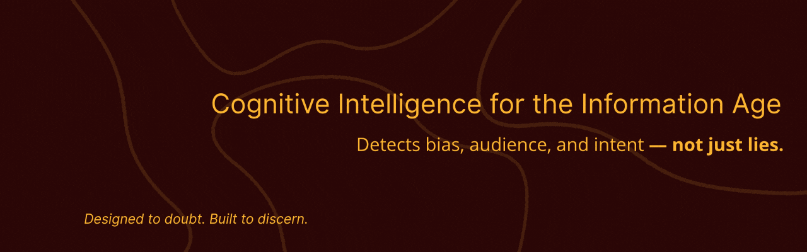

<!-- ====== GRID LAYOUT (BORDERS ON) ====== -->
<table width="100%" border="0" cellspacing="12" cellpadding="0">

  <!-- Row 1: Banner (izquierda) + Bio (derecha) -->
  <tr>
    <td style="width:50%; border:2px solid #bbb; border-radius:12px; padding:12px; vertical-align:top;">
      

        
      

    </td>

    <td style="width:50%; border:2px solid #bbb; border-radius:12px; padding:18px; vertical-align:top;">
      <h3 align="center">Hi, I’m Gonzalo Luis Romero, aka <b>DeepRat</b> — an E2E AI &amp; Full-Stack Engineer.</h3>
      

        I’ve loved science since I was 6, when I first read <i>Cosmos</i> by Carl Sagan.
        Around 15 years ago I started playing with code — mostly because I got bored of
        <a href="https://www.stalker-game.com/en/" target="_blank" rel="noopener noreferrer">S.T.A.L.K.E.R.: Shadow of Chernobyl</a> and decided to mod it.
      

      

        I dedicated <b>5</b> years of formal technical education, completed <b>20+</b> courses &amp; certifications,
        and spent the last <b>3</b> years specializing in my passion: <b>Artificial Intelligence</b>.
      

      

        Contact me for collaboration, development, or just to talk about AI, science, or an idea you’d like to bring to life.
      

      

        
        
        
        
      

    </td>
  </tr>

  <!-- Row 2: Projects (izquierda) + Skills (derecha) -->
  <tr>
    <!-- Projects -->
    <td style="width:50%; border:2px solid #bbb; border-radius:12px; padding:18px; vertical-align:top;">
      <h2>Projects</h2>

      <!-- Project 1: LTX / Fast Video Gen -->
      <table width="100%" border="0" cellspacing="0" cellpadding="6" style="margin-bottom:14px;">
        <tr>
          <td style="width:45%; vertical-align:middle;">
            
          </td>
          <td style="width:55%; vertical-align:middle;">
            <b>LTX Fast (ItV &amp; PtV) — Smart ZeroGPU Inference</b> 
            Optimized video generation demos (research-grade). 
            <i>DeepRat implementation</i>
          </td>
        </tr>
      </table>

      <!-- Project 2: MedeX -->
      <table width="100%" border="0" cellspacing="0" cellpadding="6" style="margin-bottom:14px;">
        <tr>
          <td style="width:45%; vertical-align:middle;">
            
          </td>
          <td style="width:55%; vertical-align:middle;">
            <b>MedeX — Advanced Medical AI Assistant</b> 
            RAG + LLM clinical reasoning (educational prototype). 
            <i>DeepRat implementation</i>
          </td>
        </tr>
      </table>

      <!-- Project 3: TrueEye -->
      <table width="100%" border="0" cellspacing="0" cellpadding="6" style="margin-bottom:14px;">
        <tr>
          <td style="width:45%; vertical-align:middle;">
            
          </td>
          <td style="width:55%; vertical-align:middle;">
            <b>TrueEye — Media/News Analyzer</b> 
            Detects bias, audience and manipulation in news content. 
            <i>DeepRat implementation</i>
          </td>
        </tr>
      </table>

      <!-- Project 4: Educative Lab -->
      <table width="100%" border="0" cellspacing="0" cellpadding="6">
        <tr>
          <td style="width:45%; vertical-align:middle;">
            
          </td>
          <td style="width:55%; vertical-align:middle;">
            <b>DeepRat Interactive Lessons — Educative Repo</b> 
            Hands-on labs (e.g., YOLOv8) and future modular lessons. 
            <i>Knowledge hub</i>
          </td>
        </tr>
      </table>
    </td>

    <!-- Skills -->
    <td style="width:50%; border:2px solid #bbb; border-radius:12px; padding:18px; vertical-align:top;">
      <h2>Skills</h2>

      <h4>Cloud &amp; DevOps</h4>
      

        
        
        
        
      

      <h4>Back-End &amp; APIs</h4>
      

        
        
        
        
      

      <h4>LLMs, RAG &amp; Agents</h4>
      

        
        
        
        
        
      

      <h4>Models &amp; Training</h4>
      

        
        
        
        
      

      <h4>Vision &amp; Multimodal</h4>
      

        
        
        
        
      

      <h4>Data &amp; Analytics</h4>
      

        
        
        
        
      

    </td>
  </tr>

  <!-- Row 3: Open Knowledge Vault -->
  <tr>
    <td colspan="2" style="border:2px solid #bbb; border-radius:12px; padding:18px;">
      <h2 align="center">🧠 Open Knowledge Vault — Certifications &amp; Specializations</h2>
      

        
<b>📘 Click to expand full list</b>

        <ul>
          <li><a href="https://www.coursera.org/account/accomplishments/specialization/certificate/RSIQ88E92KMH">IBM AI & Machine Learning Professional Certificate</a></li>
          <li><a href="https://www.coursera.org/account/accomplishments/specialization/certificate/KGPJ34OTAQXR">IBM Generative AI Foundations</a></li>
          <li><a href="https://www.coursera.org/account/accomplishments/verify/CXEO3X2KPEJL">Mathematics for Machine Learning — Duke University</a></li>
          <li><a href="https://www.coursera.org/account/accomplishments/certificate/RWJ6S047T5AK">Deep Learning — IBM</a></li>
          <li><a href="https://www.coursera.org/account/accomplishments/verify/SQZGS7JIGS1L">Advanced Machine Learning and Signal Processing — IBM</a></li>
          <li><a href="https://www.coursera.org/account/accomplishments/certificate/Y4YMMARVQVI1">Intro to Computer Vision and Image Processing — IBM</a></li>
          <li><a href="https://www.coursera.org/account/accomplishments/verify/DSYIPSU2SUOC">Python for Data Science, AI & Development — IBM</a></li>
          <li><a href="https://www.coursera.org/account/accomplishments/verify/ASHKW06G2OYZ">Databases and SQL for Data Science — IBM</a></li>
          <li><a href="https://www.coursera.org/account/accomplishments/verify/P93YN7IBD6SC">Tools for Data Science — IBM</a></li>
          <li><a href="https://www.coursera.org/account/accomplishments/certificate/NYRAY3CWX5OM">Data Visualization with Python — IBM</a></li>
          <li><a href="https://www.coursera.org/account/accomplishments/verify/0H61CITWOIZO">Data Analysis with Python — IBM</a></li>
          <li><a href="https://www.coursera.org/account/accomplishments/verify/SW7LSLODUZUT">Machine Learning with Python (with Honors) — IBM</a></li>
          <li><a href="https://www.coursera.org/account/accomplishments/verify/5CY9OXPL6I7U">Deep Neural Networks with PyTorch — IBM</a></li>
          <li><a href="https://www.coursera.org/account/accomplishments/verify/XWHCZJ2X7KBY">Deep Learning with TensorFlow — IBM</a></li>
          <li><a href="https://www.coursera.org/account/accomplishments/certificate/DC3R530QSFEX">Machine Learning with Python — IBM Developer Skills Network</a></li>
        </ul>
        
<i>Full record available on LinkedIn:</i> <a href="https://www.linkedin.com/in/gonzalo-luis-romero-b9b5b4355/">linkedin.com/in/gonzalo-luis-romero-b9b5b4355</a>

      

    </td>
  </tr>
</table>

---

<!-- End of README -->
