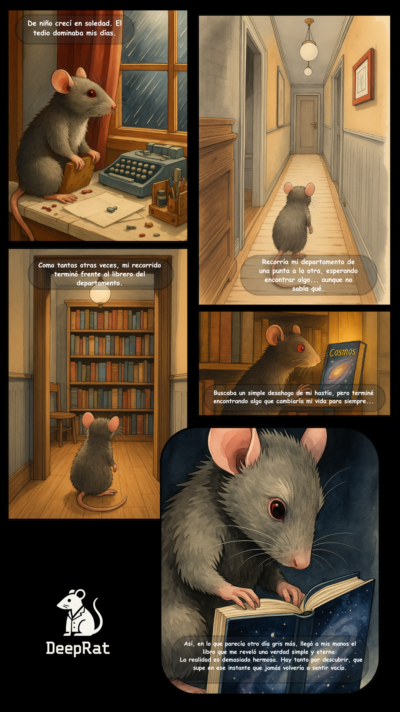

# 🧠 DeepRat — Gonzalo Romero  
**Ingeniero en Inteligencia Artificial, Software y Sistemas** · Creador de TrueEye · Pensador Técnico y Constructor Obsesivo

> “Haz que lo complejo sea accesible. Haz que lo invisible sea útil. Y diviértete un poco en el proceso.”

---

## 💡 Sobre este repositorio

Esto no es un portafolio estático.  
Es mi laboratorio. Mi diario. Mi caja de arena.

Un espacio para documentar experimentos, código, benchmarks, arquitecturas, descubrimientos — y a veces, crisis existenciales.  
Todo lo que hay acá está impulsado por la obsesión, construido desde cero, y puesto a prueba en entornos reales (usualmente con cafeína, y ocasionalmente con desesperación).

Si esto te ayuda a aprender, construir, depurar o cuestionar algo mejor — misión cumplida.

---

## 👋 Sobre mí

Hola, soy Gonzalo — pero en Internet me conocen como **DeepRat**.

Soy **Ingeniero en Inteligencia Artificial, Software y Sistemas**, formado académicamente y forjado obsesivamente en la práctica.  
Desde APIs backend y arquitecturas de recuperación, hasta agentes que analizan lenguaje e intención, diseño y construyo sistemas que piensan, conectan y explican.

Cuando tenía 6 años, un libro cayó en mis manos como una profecía:  
**Cosmos**, de Carl Sagan.

Desde entonces, recorrí todas las ramas de la ciencia — física, psicología, filosofía, biología, matemáticas — no por deber, sino por compulsión.  
Si algo tenía estructura, yo quería abrirlo y entender cómo respiraba.

Eventualmente, encontré un dominio donde podía aplicar **todo lo que sabía, amaba y cuestionaba**: la inteligencia artificial.  
Y desde ahí, no paré de construir.

  

---

## 🧠 Qué hago

### 🧩 Diseño y construyo sistemas inteligentes

- 🤖 **TrueEye** — IA para alfabetización mediática que analiza noticias, sesgos, audiencia e intencionalidad.  
- 🧠 **Sistemas Multi-Agente** — Pipelines RAG con razonamiento, memoria y delegación de tareas.  
- 📚 **Herramientas Educativas** — Como Mole, un chatbot bilingüe que aprende de tus documentos.  
- 🧪 **Benchmarks de Modelos** — Pruebas comparativas de desempeño, latencia y precisión semántica.  
- 🧬 **Prototipos Conceptuales** — Como ConCiencia, un experimento filosófico sobre autoconciencia artificial.  

---

### 🔧 Opero en toda la pila de inteligencia

**Desde la idea hasta la producción** — No solo contribuyo partes.  
Tomo ideas crudas y las convierto en sistemas desplegables: los diseño, programo, integro, optimizo y lanzo.  
Desde un prompt hasta un producto — hago todo el recorrido completo.

---

### ✨ Diseño
- Frameworks de prompt engineering, árboles de razonamiento y flujos de agentes  
- Pipelines RAG modulares con búsqueda semántica, enrutamiento híbrido, memoria y delegación  
- Arquitecturas multimodales que integran texto, visión, audio y contexto del usuario  
- Herramientas que explican, contextualizan y se adaptan a la información del mundo real  

---

### 🧱 Construyo
- Backends API con **FastAPI**, **LangChain**, **LangGraph**, y lógica con herramientas integradas  
- Agentes potenciados por **modelos open source** (LLaMA, Phi, Granite, Qwen, DeepSeek, etc.), **Claude**, **GPT-4**, **Cohere**, usando **Ollama**, **Transformers** o API  
- Motores de embeddings con **MiniLM**, **Instructor**, **Specter2**, **CLIP**, **GTE**, modelos SBERT personalizados  
- Pipelines de vectores con **FAISS**, **Chroma**, retrievers híbridos y chunking semántico  
- Inference local con **Ollama**, **GGUF**, **AutoGPTQ** y adaptadores cuantizados  
- Razonamiento por herramientas con **ToolCalling**, agentes de **LangGraph**, toolkits personalizados  
- Interfaces y apps con **Gradio**, **HTML/CSS/JS**, **Tailwind**  

---

### 🧪 Entreno y afino
- Fine-tuning con **LoRA** y **QLoRA** en **Colab A100** y Ollama local  
- Optimización con **PEFT**, **Transformers**, **bitsandbytes**  
- Scripts listos para entrenamiento, personalización de modelos, adaptación RAG y tuning instructivo  
- Despliegue de modelos cuantizados con **GGUF**, inferencia 4-bit y **AutoGPTQ**  

---

### 🚀 Despliego
- Apps en producción, demos y APIs en:
  - **Hugging Face Spaces** (Gradio o FastAPI)  
  - **Google Cloud (VMs con GPU L4 o T4)**  
  - **Servidores locales Linux vía SSH**, o apps containerizadas  
- Arquitectura de punta a punta: desde notebook hasta backend, desde datos crudos hasta aplicación en funcionamiento  

---

## ⚙️ Stack técnico (Resumen)

### 📦 Modelos de Lenguaje
- 🧠 **Open source**: LLaMA (todas las versiones), Phi (2/3/4), Qwen (chat/code/VL), DeepSeek, Granite (IBM), Gemma, Mistral, Mixtral, Falcon, Dolly, Zephyr, OpenChat, Nous-Hermes, Orca, GPT-J  
- 📡 **Vía API**: Claude 3 (Opus, Sonnet), GPT-4 / GPT-3.5, Cohere, DeepSeek Cloud, OpenRouter  
- 🖥 **Inference local**: Ollama, Transformers.js, GGUF, AutoGPTQ, llama.cpp, QLoRA deployments  

### 🔧 Entrenamiento y Optimización
- Fine-tuning con **LoRA**, **QLoRA**, **PEFT**, usando **Transformers**, **bitsandbytes**, **Colab A100** o GPU local  
- Tuning instructivo, cuantización, fusiones de adaptadores y deployment para inference liviana  

### 🔍 Embeddings y Recuperación
- Embeddings: MiniLM, Instructor-XL, GTE-base, Specter2, CLIP, E5, SBERT, Sentence-T5  
- Vector DBs: FAISS (IndexFlatIP, HNSW), Chroma, Weaviate, Milvus, Pinecone  
- Retrievers personalizados: híbridos, jerárquicos, multilingües, con peso semántico  

### 👁️ Visión y Multimodal
- Visión: **OpenCV**, **YOLOv8**, **MediaPipe**, **Vision Transformers**, **CLIP**, **BLIP**, **Qwen-VL**  
- Generación: **Stable Diffusion 1.5**, **SDXL**, **Realistic Vision**, **Dreamlike Photoreal**, pipelines prompt-to-image  
- Orquestación multimodal: texto ↔ visión ↔ audio  

### 🧱 Herramientas y Orquestación
- **LangGraph**, **LangChain**, ToolCalling, custom memory, toolkits, document loaders  
- Servicios backend con **FastAPI**, **Streamlit**, **Flask**  

### 🖥 Frontend y Deploy
- Gradio (avanzado), HTML/CSS/JS, Tailwind, Markdown rendering, Jinja2  
- Hugging Face Spaces, Google Cloud VMs (L4/T4), Colab Pro  
- Deploy local vía Docker, VM Linux + SSH, agentes Ollama  

### 🛠️ Herramientas generales y workflow
- Git, GitHub Actions, VS Code SSH, rclone, gdown, Notion, bash  
- Jupyter, Colab, documentación en Markdown, configuración de red/firewall GCP  

---

## 💬 Nota final

Todo lo que construyo es modular, reproducible y funcional —  
**No son solo notebooks. No son solo demos. Son sistemas reales que piensan, se adaptan y funcionan.**

> “La realidad es demasiado hermosa. Hay tanto por descubrir, que supe que nunca más me sentiría vacío.”  
> — *DeepRat*
